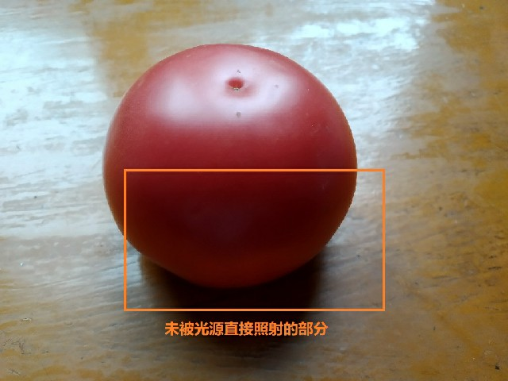
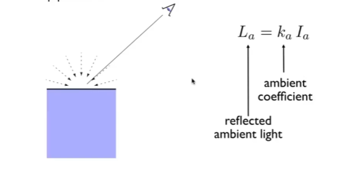
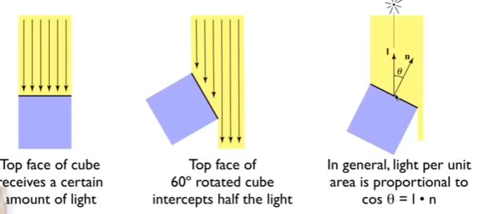
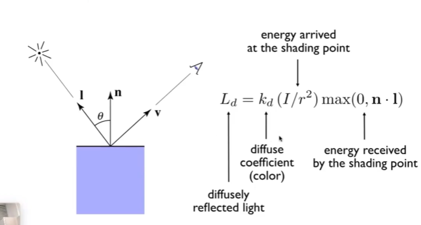
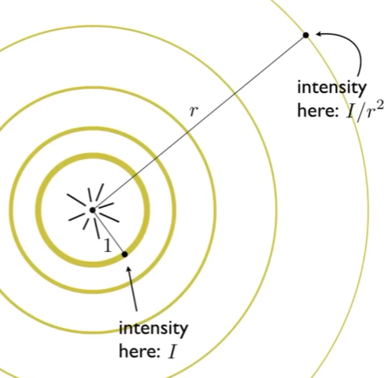
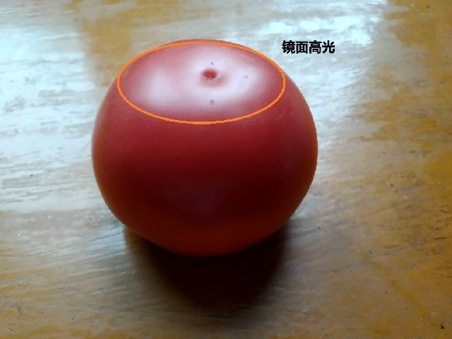
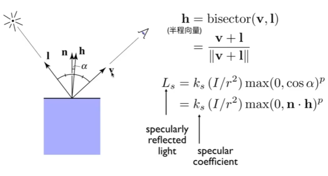
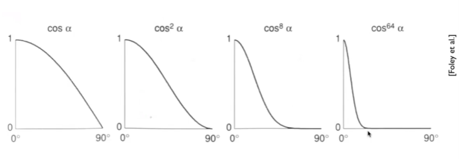
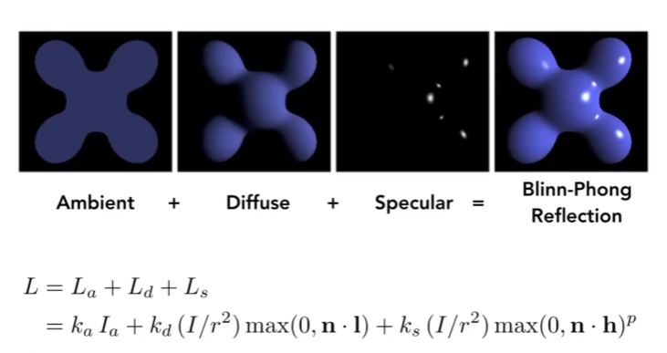

## 序言

作为在这个博客上写的第一篇博文，我准备从图形学最基础的部分开始，毕竟也才刚刚学习图形学的知识，在学习Blinn-Phong模型中遇到了一部分困难，毕竟是“CGの幻想郷”，没点基础性的存货也是说不过去的。

然后是关于Blinn-Phong模型，这是在Phong模型（即“冯氏光照模型”）的基础上对镜面高光部分进行小部分改良后所得到的改进模型。相较于Phong模型，在镜面高光计算部分优化了性能开销，并且解决了一部分Phong模型中存在的问题。

当然，与Phong模型一致，Blinn-Phong模型由三个部分组成：***镜面高光（Specular Highlight）、漫反射（Diffuse Reflection）*** 以及 ***环境光（Ambient Lighting）*** 。

在接着往下之前，先预定义几个概念：
1.**视线方向（v）**：以着色点为起点，观察点为终点的直线的方向向量。
2.**表面法线（n）**：着色点所在切平面的法向量。
3.**光源方向（i）**：以着色点为起点，观察点为终点的直线的方向向量。

如果看到这篇博文的各位有什么问题需要反馈，可以在我的[博客项目库](https://github.com//HuajiKojima//HuajiKojima.github.io)Issue一下(。・∀・)ノ(闲聊也是可以的，不过仅限于图形学方面的哦)。

## 1.环境光照（Ambient Lighting）

接下来让我用这颗为图形学领域奉献的番茄先驱举个例子：

从光沿直线传播理论以及人眼成像原理来说，番茄没被光源直接照射的部分应该是除轮廓外不可视的，但现实情况是未被光源照射的部分是可被观察到的，其实如果说按照真实光照环境进行模拟的话，会发现光源打在环境中其它部分的光线会经过有限次反射或折射后再次打在番茄的任何一点上。从而将未被光源直接照射到的部分显现出来，这便是 **环境光**。但是由于如果用计算机渲染对环境中的光线进行完全模拟，则会造成非常大的性能开销，在提出此模型的20世纪70年代以及现今的实时渲染领域均不是最节约的方法（虚幻5的动态全局光照技术暂且抛开不论）。

于是，秉承着 “懒惰是人类进步的根本” 的理念，并且由于环境光对于番茄的成像影响变化不大，即番茄上每一点受到环境光的影响都较为相似，所以在Blinn-Phong模型中认为番茄上受到的环境光影响是一致的，至于具体的影响程度数值，那就交给美工自己去想吧（笑）。

综上所述，Blinn-Phong模型的环境光可被描述如下：

其中Ka便是**环境光照系数**，它也可以是RGB颜色向量。从计算式中可以很明显的看出，环境光不受视线方向、光源方向以及法线的影响，也就是说无论你如何更改光源的方向，无论从哪个方向观察番茄，暗处的环境光大小都是一致的（这里说暗处是因为暗处更好观察到环境光对番茄的影响）。

## 2.漫反射（Diffuse Reflection）

好了，有了可以反映暗处颜色的环境光，接下来我们会思考一个问题：既然说了番茄上有暗面，那么番茄上的明暗变化如何体现？当然，用人们经常用的一句话来说：计算机可没有人那么聪明。接下来就会运用到Blinn-Phong模型中的**漫反射**模型来让计算机去实现我们想要的效果。

Blinn-Phong中的漫反射模型运用的是Lambert漫反射模型，在说明此漫反射模型前需要明确一下：这里说的漫反射与各位在维基百科或者是百度百科中所看到的漫反射定义有一定不同。

首先说一下百度百科的定义：当一束平行的入射光线射到粗糙的表面时，表面会把光线向着四面八方反射，所以入射线虽然互相平行，由于各点的法线方向不一致，造成反射光线向不同的方向无规则地反射，这种反射称之为“漫反射”或“漫射”。

然而Lambert漫反射模型与现实情况不同的地方便是——**此模型不考虑粗糙度**，默认模型是光滑的，只是应用了法线不一致导致明暗变化的原理，考虑粗糙度的话那就是PBR（Physically-Based-Rendering）模型了。

那么，问题来了：Lambert漫反射模型是如何表示明暗变化的？接下来就要引入一个概念：Lambert余弦定理。请看下图：

Lambert模型中设定每一个着色点的明暗程度是由接收到光的能量（反映到平面上其实也就是光线的多少）所决定，接收到光的能量越多，此着色点的颜色越亮，这也是符合真实物理规律的。当我们将图中所示蓝色方块顺时针旋转60°时，我们会发现使用加粗线段所表示的平面接收到的能量小于先前接收的，在通常条件下，如果要用 **n** 与 **i** 来计算出入射角大小从而来算出被计算表面需要接收的光的能量，那显然会增加过多的计算开销。于是，Lambert模型使用 **n** 与 **i** 夹角余弦来进行计算，并得出如下结论：**接收到能量的大小与入射角余弦呈正比例关系**。

于是综上所述，我们便可以得到Lambert漫反射模型的计算式：

关于此计算式中几点需要注意：
i. 设定 **I** 为光线传输着色点相应上的能量，其值会随着距离 r 增大而减小，距离为 **r** 时，传输的能量为 **I/(r·r)** 如下所示：

ii. 当光照沿着着色面背面发射而来，然而着色面为不透明性质时，此时可当作没有光线射在着色点上，即如果入射角余弦值为负，则默认为0，所以会有max（0，n · l）。

iii. Kd值（漫反射系数）可以是RGB向量，最终运算结果是结合了明暗的颜色值。

## 3.镜面高光（Specular Highlight）

在解决了明暗变化以及环境光两个模型后，接下来就是镜面高光部分，如下图所示：

这里也是Phong模型与Blinn-Phong模型有区别的地方，先说一下Phong模型中镜面高光的描述：

在初中的光学物理理论里面我们就学过镜面反射原理，当 **v** 与反射光线重合时，我们便会看到光源亮斑，Phong模型中的镜面高光便是模拟这种情况的，Phong模型中会完全模拟我们在初中物理作业本上计算反射光照的过程，但这样做会加大计算量，导致性能开销增大。

改进后的Blinn-Phong模型则是优化了这一部分，Blinn-Phong模型认为，当 **v** 与 **i** 的 **半程向量（Halfway Vector）**与法线向量重合时，则认为反射光线与 **v** 重合，即摄像机观察到高亮部分。计算式如下：

半程向量很好求得，利用平行四边形法则计算和向量后归一化即可。其中，Ks 为环境光系数，也可为颜色向量。

关于指数 **p** ：由于余弦函数受n次幂的影响表示如下：

在现实情况中，一般的高光均多以细小光斑表现，在普通的实时渲染中，光斑可视角度较小，则相应变化幅度也必定越大，则会运用 p 来控制变化幅度。

## 结束语

最终三个部分相加后即可得到如下结果：

这便是我们想要的效果。

作为图形学最基础的部分，这一部分都让人感觉有些迷茫，尤其是对漫反射部分的理解上。花了大量的时间，用OpenGL写了两三个shader才最终搞明白这部分的东西，感觉光栅化的抗锯齿部分都没有这么难理解，看来路途很长啊。好了，去吃番茄了。

**Reference**：

1.GAMES101：现代计算机图形学入门 —— 闫令琪
2.【一步步学Metal图形引擎10】-《高级光照模型1：Cook-Torrance BRDF》
3.一颗为计算机图形学献身的番茄
